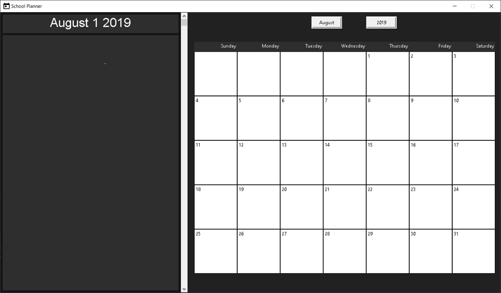

# SummerPlanner
GUI Application made in Python using tkinter package.
Made for my personal use. I had trouble keeping track of deadlines and important dates relating to schoolwork. To better accustom myself to Python, better organize future assignments and to keep myself occupied.

## Running Program
Requires Python to run. Run "main.pyw" to open the program. Do not touch "test.pickle", editing it will probably mess with the program because it cannot read the data format. If it does happen, delete everything in "test.pickle". This is if you cannot redo your past edit.

## Using Program
To create a task, right click on a calendar day and input your desired information on the new window that popped up. Ensure that none of the fields are empty and that the title is unique for that date. Left click on the calendar day to display the task and their respective description on the left side of the screen. You can collapse or expand the frame by clicking on the corresponding image. Double click the frame if you want to edit or delete the task

## Visual Example

